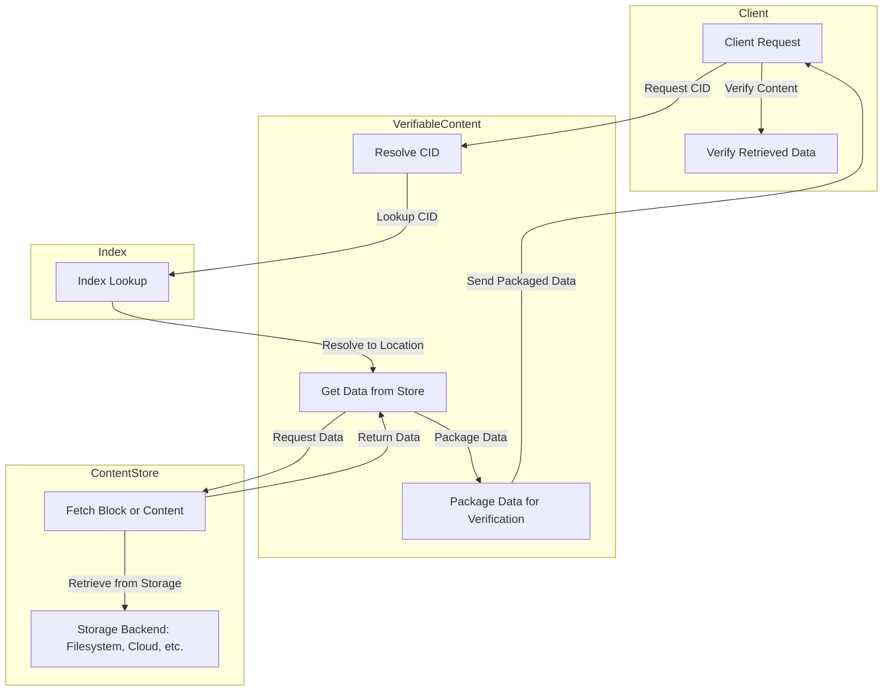

# Content Store Specification


## Editors

- [Vasco Santos](https://github.com/vasco-santos)

## Authors

- [Vasco Santos](https://github.com/vasco-santos)

# Abstract

This document describes the Content Store, responsible for retrieving verifiable containers and blocks efficiently.

## Language

The key words "MUST", "MUST NOT", "REQUIRED", "SHALL", "SHALL NOT", "SHOULD", "SHOULD NOT", "RECOMMENDED", "MAY", and "OPTIONAL" in this document are to be interpreted as described in [RFC2119](https://datatracker.ietf.org/doc/html/rfc2119).

# Overview

The Content Store provides structured access to stored data using an indexing layer. It supports both:

- **Block retrieval**: For individual block lookups.
- **Container retrieval**: For whole DAG lookups.

Retrieval is enabled by the [Index Specification](./index.md), which maintains metadata about stored content.

## Design Principles

- **Trustless verification**: Ensures clients can verify retrieved content.
- **Efficient storage access**: Optimized for cost and speed.
- **Pluggable storage backends**: Supports different storage layers (e.g., filesystem, cloud storage).

## Store Interfaces

### Content Store Interface

```ts
interface ContentStore {
  // Retrieve a block's raw bytes from its known location
  getBlock(location: BlockLocation): Uint8Array | null

  // Retrieve an entire content package given its resolved locations
  getContent(contentLocation: ContentLocation): AsyncIterable<Uint8Array>
}

// Link https://ipld.io/specs/codecs/dag-json/spec/#links
type BlockLocation = {
  container: Link<any>
  offset: Int
  length: Int
}

type ContentLocation = {
  contentCID: Link<any>
  containers: ContainerLocation[]
}
```

- **Blocks**: Resolved via the Index to determine `BlockLocation`, then retrieved as raw-encoded objects from `ContentStore.getBlock`.
- **Content**: Resolved via the Index to determine `ContentLocation`, then retrieved as a CAR file by reading all blocks from `ContentStore.getContent`.

## Relationship Between Components

The Content Store, Index, and Verifiable Content interface work together to provide structured and efficient access to stored data:

1. **Index Maintains Metadata**

   - The [Index](./index.md) maintains mappings of content identifiers (CIDs) to their storage locations.
   - When a client requests a block or content via `VerifiableContent`, the Index resolves the corresponding `BlockLocation` or `ContentLocation`.

2. **Verifiable Content Fetches Data**

   - The `VerifiableContent` interface acts as the main entry point for clients requesting content.
   - It queries the Index to resolve locations and then calls the Content Store for actual data retrieval.

3. **Content Store Provides Raw Data**

   - Uses the resolved locations from the Index to fetch the required blocks or containers.
   - Supports multiple storage backends for optimized access.

4. **Verifiable Retrieval**
   - Ensures data integrity by returning encoded content that clients can validate.
   - Blocks are retrieved as raw-encoded objects, and content is packaged as CAR files.



## Storage Implementation Strategies

### Filesystem-based Store

- Blocks and containers stored as files.
- Uses indexing for quick lookups.

### Cloud Storage Backend

- Uses object storage (e.g., S3, GCS).
- Indexes maintained separately for efficient access.

## Future work

- implementation suggestions for storage, like which keys are good idea to use, etc

For indexing details, see the [Index Specification](./index.md).
