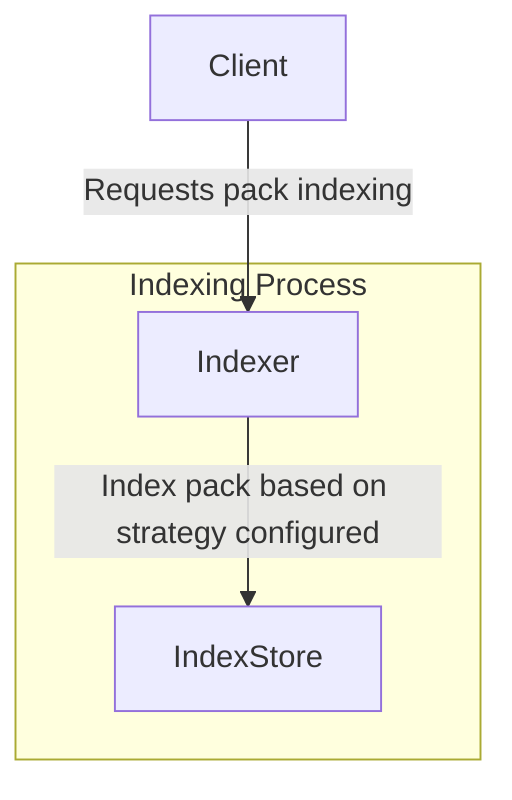

# Index writer specification


## Editors

- [Vasco Santos](https://github.com/vasco-santos)

## Authors

- [Vasco Santos](https://github.com/vasco-santos)

# Abstract

This document describes an indexing writer protocol that enables content-addressable data to be served efficiently by a server relying on the indexes written as described in this spec.

This writer spec complements the [Index spec](./index.md) by describing index creation and persistence.

## Language

The key words "MUST", "MUST NOT", "REQUIRED", "SHALL", "SHALL NOT", "SHOULD", "SHOULD NOT", "RECOMMENDED", "MAY", and "OPTIONAL" in this document are to be interpreted as described in [RFC2119](https://datatracker.ietf.org/doc/html/rfc2119).

# Overview

Smart client implementations MAY request a verifiable pack as a single verifiable blob (e.g. RAW) or as a verifiable pack of blobs (e.g., CAR file). The server relies on indexes that enable it to handle requests efficiently. This specification cover the index writer primitives.

Like the [Index Spec](./index.md), this specification defines an indexing system that MUST support:

- **Single-level index**: Maps a given blob multihash to the location where the server can read the bytes.
- **Multiple-level index**: Maps a containing multihash to the set of verifiable pack multihashes that compose it.

## Design Principles

The design of the indexing writer considers the following key aspects:

### Storage Efficiency & Cost Optimization:

- The protocol aims to minimize storage and retrieval costs by leveraging compact and structured index formats.
- Different backends (e.g., file-based, JSON, SQL, external CARv2 indexes) provide flexible storage options.

### Upgradability & Versioning:

- Index record schemas are versioned to allow future enhancements while maintaining compatibility.
- Future optimizations might include truncating stored multihashes to the last six characters, as the bytes can be validated by re-hashing.
- Indexes could store only byte ranges, rather than intermediary multihashes, requiring clients to provide metadata at request time on where they are at.

## System Design

### Index Record

(as defined in [Index spec][./index.md])

```ts
import { MultihashDigest } from 'multiformats'

type IndexRecord = {
  type: IndexRecordType
  // hash digest of the location or Path
  location: MultihashDigest | Path
  // length of the data
  length?: Int
  // offset of the data in the location byte stream
  offset?: Int
  // associated records
  subrecords: Array<IndexRecord>
}

// Record Type Enum
type IndexRecordType = BLOB | PACK | CONTAINING
type BLOB = 0
type PACK = 1
type CONTAINING = 2

type Path = string
```

### Index Store

```ts
import { MultihashDigest } from 'multiformats'

interface IndexStoreWriter {
  set(hash: MultihashDigest, entry: IndexRecord[]): Promise<void>
}
```

### Index Writer Interface

The index MUST support putting new indexes with locations.

```ts
import { MultihashDigest } from 'multiformats'

interface BlobIndexRecord {
  multihash: MultihashDigest
  offset: number
  length: number
}

interface IndexWriter<StoreRecord> {
  // Stores indexed entries
  store: IndexStore<StoreRecord>

  // Adds blob indexes associated with a pack, optionally with a containing Multihash that has a relationship with the pack.
  addBlobs(
    blobIndexIterable: AsyncIterable<BlobIndexRecord>,
    packMultihash: MultihashDigest,
    // in a multi-level-index this can be used with the contaning Multihash from where this pack belongs
    // similar to https://github.com/ipfs/specs/pull/462
    options?: { contaningMultihash?: MultihashDigest }
  ): Promise<void>
}
```

### Record Persistence

To enable upgradability, index records MUST be stored with a versioning. Moreover, set of information associated with the record needs to be stored. Store implementations can store records according to what fits better, as long as they can construct the records as described in the schema below:

```ts
type IndexRecord = Variant<{
  'index/blob@0.1': BlobIndexRecord
  'index/containing@0.1': ContainingIndexRecord
}>

// This schema type represents all the information that should be encoded about the Index Record
// Not required to be stored likewise. For instance, `multihash` MAY be a key in a KV store.
type BlobIndexRecord = {
  // hash digest of the blob
  digest: Multihash
  // hash digest of the pack containing the blob
  pack: Multihash
  // Slice offset
  offset: Int
  // Slice size in bytes
  length: Int
}

// This schema type represents all the information that should be encoded about the Index Record
// Not required to be stored likewise. For instance, `containing` MAY be a key in a KV store.
type ContainingIndexRecord = {
  // hash digest of containing
  containing: Multihash
  // hash digest of packs that represent the content
  // this can be encoded right on the spot, or externally stored (e.g. CarV2 index)
  packs: PackIndexRecord[]
}

type PackIndexRecord = {
  // hash digest of the pack
  multihash: Multihash
  // blobs within the pack
  blobs: BlobRecord[]
}

type BlobRecord = [
  // hash digest of the blob
  digest: Multihash
  // Slice offset
  offset: Int
  // Slice size in bytes
  length: Int
]

type Multihash = bytes
```

### External Indexing

An index store MAY rely on external indexes to be able to populate their records as defined above. For instance, they can have on the side `CARv2` like indexes and simply rely on the multihash of the pack to resolve them.

#### CARv2 Index Store

```ts
import { MultihashDigest } from 'multiformats'

interface CarV2IndexStore {
  loadIndex(packMultihash: MultihashDigest): CarV2Index | null
  storeIndex(packMultihash: MultihashDigest, index: CarV2Index): void
}
```

## Relationship Between Components

**Indexing New Content**

1. A client requests a given pack to be indexed. The Blobs within the Pack MAY have some cryptographic relationship identified by a Containing Multihash.
2. The Indexer determines the appropriate index type (single-level or multi-level) based on configured indexing strategies.
3. The selected index is generated and stored in the Index Store.



## Implementation Guide

Different storage backends can be used to store these index formats while fulfilling the schema. The critical queries are determining where a given blob is stored (pack multihash and byte range) or locating all the packs/blobs that have a `containing` cryptographic relationship.

### Single-level Index Implementation

- **Filesystem-based store (path encoding):**
  - Example: `blob...5/index/blob@0.1/car..1/0-128`
  - **Advantages:**
    - Simple and cost-effective, no database required
    - A cloud based object storage can be used for scalability
  - **Tradeoffs:**
    - May be slower than a database query (e.g. DynamoDB), but likely not a bottleneck in most cases.
- **Encoded JSON-based store**
  - Example:
    ```json
    {
      "index/blob@0.1": {
        "blob": "mh(blob..5)",
        "pack": "mh(car..1)",
        "range": [0, 128]
      }
    }
    ```
  - **Advantages:**
    - Portable
    - Easy to store in key-value DBs keyed by blob multihash
  - **Tradeoffs:**
    - Parsing overhead
- **SQL-based index:**
  - **Advantages:**
    - Easy to storage.
  - **Tradeoffs:**
    - Requires composite keys given the blob MAY exist in multiple packs, increasing queries complexity and response times.
    - more expensive to operate

### Multiple-level index implementation guide

- **Linked CARv2 Indexes:**
  - Uses references to precomputed and stored CARv2 indexes externally stored. It should be keyed by containing multihash for querying.
  - Example:
    ```json
    {
      "index/containing@0.1": {
        "containing": "mh(bafy..dag)",
        "packs": ["mh(bag..left)", "mh(bag..right)"]
      }
    }
    ```
  - **Advantages:**
    - Efficient for streaming all packs combined as a trustless pack.
    - Only keeps minimal information optimizing for low index sizes.
    - Can re-use CARv2 indexes previously computed.
  - **Tradeoffs:**
    - Not efficient to use for querying for individual blobs, as individual external indexes need to be retrieved and parsed.
- **Embedded Slice Mapping in Index:**
  - Embeds blob locations directly in the index file. For instance, within a CAR file that encoded the index data. It should be keyed by containing multihash for querying.
  - Example:
    ```json
    {
      "index/containing@0.1": {
        "containing": "mh(bafy..dag)",
        "packs": ["mh(bag..left)"]
      },
      "mh(bag..left)": [
        ["blob..1", 0, 128],
        ["blob..2", 129, 256],
        ["blob..3", 257, 384],
        ["blob..4", 385, 51]
      ]
    }
    ```
  - **Advantages:**
    - Proven solution already deployed and used by Storacha.
    - Compatible indexes with the ones created by Storacha and tooling already available.
    - Efficient to find where a blob is stored when the containing multihash is also known.
    - Can work independently of CAR files.
  - **Tradeoffs:**
    - More costly to decode for bulk streaming.
    - More costly to store indexes if blob positions are irrelevant.
