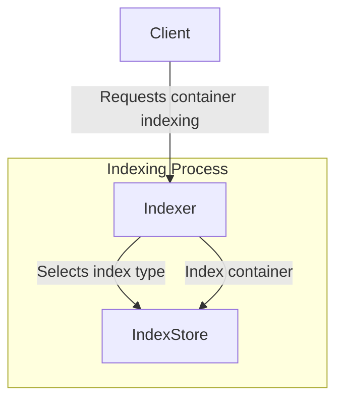
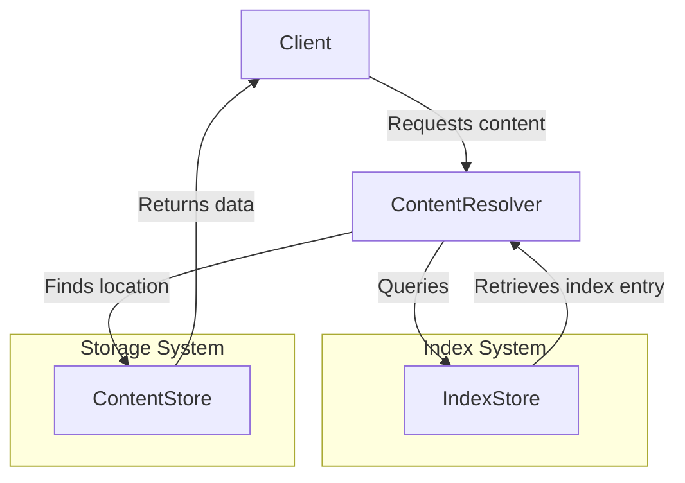

# Index specification


## Editors

- [Vasco Santos](https://github.com/vasco-santos)

## Authors

- [Vasco Santos](https://github.com/vasco-santos)

# Abstract

This document describes an indexing protocol that enables content-addressable data to be served efficiently by a server with access to stored verifiable containers and indexes.

## Language

The key words "MUST", "MUST NOT", "REQUIRED", "SHALL", "SHALL NOT", "SHOULD", "SHOULD NOT", "RECOMMENDED", "MAY", and "OPTIONAL" in this document are to be interpreted as described in [RFC2119](https://datatracker.ietf.org/doc/html/rfc2119).

# Overview

Smart client implementations MAY request a verifiable container as a single verifiable blob (e.g. RAW) or as a verifiable container of blobs (e.g., CAR file). The server SHOULD create and maintain indexes that enable it to address both types of requests efficiently. This specification cover the index primitives to enable verifiable content retrievability.

# Fundamentals

There are three different **fundamental units**, which the indexing system MAY be able to index and enable queries for:

- A **Blob** is a set of bytes that is individually addressed by a multihash. It can be stored as is in a given store, or within a Container.
- A **Container** holds several Blobs and is also individually addressed by a multihash (can also be seen as a Blob itself). Multiple **containers** MAY store the same Blob.
- A piece of **Content** can be individually addressed by a multihash and can be sliced into several containers.

This specification defines an indexing system that MUST support:

- **Single-level index**: Maps a given blob multihash to the location where the server can read the bytes.
- **Multiple-level index**: Maps a content multihash to a set of verifiable container multihashes, which contain the blobs that represent the content.

The choice of which indexing strategy to use depends on performance, cost, and use case requirements. Depending on the available clients, the content provider's setup, or the usage context of the content-addressable server, the content provider can decide which indexing system to use—or whether to use both.

## Single-level index

A single-level index maps blob multihashes to the locations where the server can read the bytes of a given blob. An indexing strategy with these records enables fast responses for clients requesting verifiable blobs by their multihash. However, in some setups, implementing this indexing strategy may be prohibitively expensive (e.g., in databases like DynamoDB) or limited (e.g., due to rate limiting when indexing thousands of blobs in parallel from large containers). Furthermore, these indexes alone are insufficient to serve fully verifiable containers, as they do not maintain relationships between blobs in a piece of Content.

## Multiple-level index

A Multiple-level index maps content multihashes to a list of verifiable containers containing the blobs that form a given content. This approach allows serving fully verifiable containers efficiently while reducing index store operations by several orders of magnitude. However, this index alone cannot serve blob-level requests unless the request includes hints about the content multihash context.

# Design Principles

The design of the indexing system considers the following key aspects:

## Modular & Pluggable Indexing:

- The protocol supports multiple indexing strategies based on different trade-offs.
- Implementations can choose the best index type depending on cost, performance, and use case.
- Supports integrating new indexing mechanisms without requiring changes to the core protocol.

## Storage Efficiency & Cost Optimization:

- The protocol aims to minimize storage and retrieval costs by leveraging compact and structured index formats.
- Different backends (e.g., file-based, JSON, SQL, external CARv2 indexes) provide flexible storage options.

## Upgradability & Versioning:

- Index record schemas are versioned to allow future enhancements while maintaining compatibility.
- Future optimizations might include truncating stored multihashes to the last six characters, as content can be validated by re-hashing.
- Indexes could store only byte ranges in the content rather than intermediary multihashes, requiring clients to provide context at request time on where they are at.

## System Design

The indexer system can be decoupled into a set of key components.

### Location Record

A location for a blob identified by a `MultihashDigest` can be represented as follows:

```ts
import { MultihashDigest } from 'multiformats'

type LocationRecord = {
  // hash digest of the blob
  // multihash: Multihash // TODO: Should we really drop it? How are we going to know if it is repeated
  // hash digest of the container containing the blob
  container: MultihashDigest
  // Container offset
  offset: Int
  // Blob size in bytes
  length: Int
}
```

This Location Type can also be used to index containers themselves if desired, by pointing to iself as container.

### Index Store

```ts
import { MultihashDigest } from 'multiformats'

interface IndexStore<IndexRecord> {
  get(hash: MultihashDigest): Promise<IndexRecord[]>
  set(hash: MultihashDigest, entry: IndexRecord[]): Promise<void>
}

// Index Record is dependent on the implementation index
```

### Index Interface

The index MUST support adding new indexes and query them, in order to locate indexed blobs.

```ts
import { MultihashDigest } from 'multiformats'

interface BlobIndexRecord {
  multihash: MultihashDigest
  offset: number
  length: number
}

interface Index<IndexRecord> {
  // Stores indexed entries
  store: IndexStore<IndexRecord>

  // Adds blob indexes associated with a container, optionally with a context Multihash that has a relationship with the container.
  add(
    blobIndexIterable: AsyncIterable<BlobIndexRecord>,
    containerMultihash: MultihashDigest,
    // in a multi-level-index this can be used with the content Multihash from where this container belongs
    // similar to https://github.com/ipfs/specs/pull/462
    options?: { contextMultihash?: MultihashDigest }
  ): Promise<void>

  // Get a stream of the location of the blobs represented by given multihash
  streamLocations(
    multihash: MultihashDigest,
    // in a multiple-level-index this can be used with the content Multihash
    // similar to https://github.com/ipfs/specs/pull/462
    options?: { contextMultihash?: MultihashDigest }
  ): AsyncIterable<LocationRecord>
}
```

### Record Persistence

To enable upgradability, index records MUST be stored with a versioning. Moreover, set of information associated with the record needs to be stored. Store implementations can store records as they wish, as long as they can construct the records described in the schema below:

```ts
type IndexRecord = Variant<{
  'index/blob@0.1': BlobIndexRecord
  'index/multi@0.1': MultipleLevelIndexRecord
}>

// This schema type represents all the information that should be encoded about the Index Record
// Not how it should be stored. For example, `multihash` MAY be a key in a KV store.
type BlobIndexRecord = {
  // hash digest of the blob
  digest: Multihash
  // hash digest of the container containing the blob
  container: Multihash
  // Slice offset
  offset: Int
  // Slice size in bytes
  length: Int
}

// This schema type represents all the information that should be encoded about the Index Record
// Not how it should be stored. For example, `content` MAY be a key in a KV store.
type MultipleLevelIndexRecord = {
  // hash digest of content
  content: Multihash
  // hash digest of containers that represent the content
  // this can be encoded right on the spot, or externally stored (e.g. CarV2 index)
  containers: ContainerIndexRecord[]
}

type ContainerIndexRecord = {
  // hash digest of the container
  multihash: Multihash
  //
  blobs: BlobRecord[]
}

type BlobRecord = [
  // hash digest of the blob
  digest: Multihash
  // Slice offset
  offset: Int
  // Slice size in bytes
  length: Int
}]

type Multihash = bytes
```

### External Indexing

#### CARv2 Index Store

```ts
import { UnknownLink } from 'multiformats'

interface CarV2IndexStore {
  loadIndex(containerCID: UnknownLink): CarV2Index | null
  storeIndex(containerCID: UnknownLink, index: CarV2Index): void
}

type CarV2Index = {
  container: UnknownLink
  blobs: ContainerIndexRecord
}
```

## Relationship Between Components

### Indexing New Content

1. A client requests a given container to be indexed. This container may optionally be associated with a specific Content.
2. The system determines the appropriate index type (single-level or multi-level) based on configured indexing strategies.
3. The selected index is generated and stored in the Index Store.



### Reading Previously Indexed Content

1. A client requests content using a give Content Resolver.
2. The Content Resolver queries the appropriate Index (single-level or multi-level).
3. The Index provides locations where blobs are stored.
4. The Content Store retrieves the actual data based on the resolved locations (see `content-store.md`).



For content retrieval, see the [Content Store Specification](./content-store.md).

## Implementation Guide

Different storage backends can be used to store these index formats while fulfilling the schema. The critical queries are determining where a given blob is stored (container multihash and byte range) or locating all the containers that represent a given content multihash.

### Type comparison

| Feature                                                | top-level Index | multiple-level Index |
| ------------------------------------------------------ | --------------- | -------------------- |
| Supports single blob lookups by blob multihash only    | ✅              | ❌                   |
| Supports entire content retrieval by content multihash | ❌              | ✅                   |
| Storage cost                                           | High            | Low                  |
| Lookup speed for a blob                                | Fast            | Slower               |
| Lookup speed for an entire DAG                         | Slower          | Fast                 |

### Single-level Index Implementation

- **Filesystem-based store (path encoding):**
  - Example: `blob...5/index/blob@0.1/car..1/0-128`
  - **Advantages:**
    - Simple and cost-effective, no database required
    - A cloud based object storage can be used for scalability
  - **Tradeoffs:**
    - May be slower than a database query (e.g. DynamoDB), but likely not a bottleneck in most cases.
- **Encoded JSON-based store**
  - Example:
    ```json
    {
      "index/blob@0.1": {
        "blob": "mh(blob..5)",
        "container": "mh(car..1)",
        "range": [0, 128]
      }
    }
    ```
  - **Advantages:**
    - Portable
    - Easy to store in key-value DBs keyed by blob multihash
  - **Tradeoffs:**
    - Parsing overhead
- **SQL-based index:**
  - **Advantages:**
    - Easy to storage.
  - **Tradeoffs:**
    - Requires composite keys given the blob MAY exist in multiple containers, increasing queries complexity and response times.
    - more expensive to operate

### Multiple-level index implementation guide

- **Linked CARv2 Indexes:**
  - Uses references to precomputed and stored CARv2 indexes externally stored. It should be keyed by content multihash for querying.
  - Example:
    ```json
    {
      "index/multi@0.1": {
        "content": "mh(bafy..dag)",
        "containers": ["mh(bag..left)", "mh(bag..right)"]
      }
    }
    ```
  - **Advantages:**
    - Efficient for streaming all content containers as a trustless container.
    - Only keeps minimal information optimizing for low index sizes.
    - Can re-use CARv2 indexes previously computed.
  - **Tradeoffs:**
    - Not efficient to use for querying for individual blobs in a given content, as individual external indexes need to be retrieved and parsed.
- **Embedded Slice Mapping in Index:**
  - Embeds blob locations directly in the index file. For instance, within a CAR file that encoded the index data. It should be keyed by content multihash for querying.
  - Example:
    ```json
    {
      "index/multi@0.1": {
        "content": "mh(bafy..dag)",
        "containers": ["mh(bag..left)"]
      },
      "mh(bag..left)": [
        ["blob..1", 0, 128],
        ["blob..2", 129, 256],
        ["blob..3", 257, 384],
        ["blob..4", 385, 51]
      ]
    }
    ```
  - **Advantages:**
    - Proven solution already deployed and used by Storacha.
    - Compatible indexes with the ones created by Storacha and tooling already available.
    - Efficient to find where a blob is stored when the content multihash is also known.
    - Can work independently of CAR files.
  - **Tradeoffs:**
    - More costly to decode for bulk streaming.
    - More costly to store indexes if blob positions are irrelevant.
