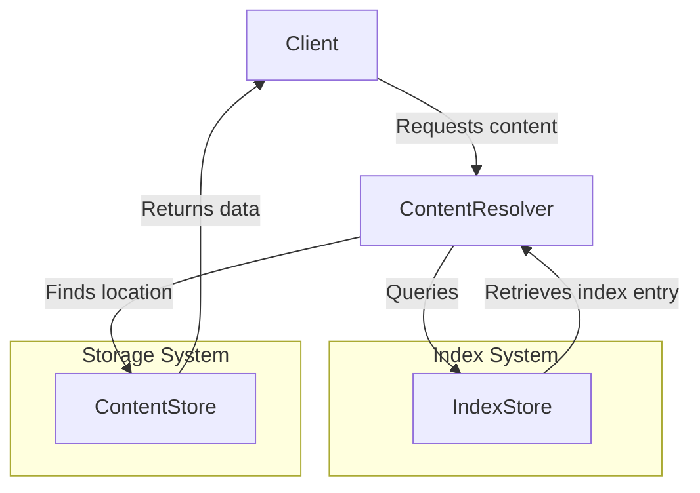

# Index specification


## Editors

- [Vasco Santos](https://github.com/vasco-santos)

## Authors

- [Vasco Santos](https://github.com/vasco-santos)

# Abstract

This document describes an indexing protocol that enables content-addressable data to be served efficiently by a server with access to stored verifiable containers and indexes.

## Language

The key words "MUST", "MUST NOT", "REQUIRED", "SHALL", "SHALL NOT", "SHOULD", "SHOULD NOT", "RECOMMENDED", "MAY", and "OPTIONAL" in this document are to be interpreted as described in [RFC2119](https://datatracker.ietf.org/doc/html/rfc2119).

# Overview

Smart client implementations MAY request a verifiable container as a single verifiable block (RAW block) or as a verifiable container (e.g., CAR file). The server SHOULD create and maintain indexes that enable it to address both types of requests efficiently.

This specification defines two types of indexes:

- **Block-level index**: Maps a given block multihash to the location where the server can read the bytes of the block.
- **Multiple-level index**: Maps a content multihash to a list of verifiable package CIDs containing the blocks that form the DAG for that content.

The choice of which indexing strategy to use depends on performance, cost, and use case requirements. Depending on the available clients, the content provider's setup, or the usage context of the content-addressable server, the content provider can decide which indexing system to use—or whether to use both.

## Design Principles

The design of the indexing system considers the following key aspects:

- **Upgradability & Versioning:**
  - Index schemas are versioned to allow future enhancements while maintaining compatibility.
  - Future optimizations might include truncating stored multihashes to the last six characters, as content can be validated by re-hashing.
  - Indexes could store only byte ranges in the DAG rather than intermediary multihashes, requiring clients to provide context at request time on where they are at.
- **Modular & Pluggable Indexing:**
  - The protocol supports multiple indexing strategies based on different trade-offs.
  - Implementations can choose the best index type depending on cost, performance, and use case.
  - Supports integrating new indexing mechanisms without requiring changes to the core protocol.
- **Storage Efficiency & Cost Optimization:**
  - The protocol aims to minimize storage and retrieval costs by leveraging compact and structured index formats.
  - Different backends (e.g., file-based, JSON, SQL, external CARv2 indexes) provide flexible storage options.

## Index Types

### Block-level index

A Block-level index maps a given block multihash to the location where the server can read the bytes of the block. This indexing strategy enables fast responses for clients requesting verifiable blocks by a block CID. However, in some setups, implementing this indexing strategy may be prohibitively expensive (e.g., in databases like DynamoDB) or limited (e.g., due to rate limiting when indexing thousands of blocks in parallel from large containers). Furthermore, these indexes alone are insufficient to serve fully verifiable containers, as they do not maintain relationships between blocks in a DAG.

#### Block-level Type index Schema

```ts
type Index = Variant<{
  'index/block@0.1': BlockIndex
}>

type BlockIndex = {
  // hash digest of the container containing the block
  digest: Multihash
  // Slice offset
  offset: Int
  // Slice size in bytes
  length: Int
}

type Multihash = bytes
```

### Multiple-level index

A Multiple-level index maps a content multihash to a list of verifiable package CIDs containing the blocks that form the DAG for that content (and where they are positioned). This approach allows serving fully verifiable containers efficiently while reducing index store operations by several orders of magnitude. However, this index alone cannot serve block-level requests unless the request includes hints about the content CID context.

#### Multiple-level Type index Schema

```ts
type Index = Variant<{
  "index/sharded/dag@0.1": ShardedDAGIndex
}>

type ShardedDAGIndex = {
  // content root CID
  content: Link<any>
  // links to indexes that contain blocks of the content DAG
  shards: Link<BlobIndex>[]
}

type BlobIndex = [
  // hash digest of the blob
  digest: Multihash
  // Index of blob slices
  slices: BlobSlice
]

type BlobSlice = [
  // hash digest of the slice
  digest: Multihash
  // Slice offset
  offset: Int
  // Slice size in bytes
  length: Int
]

type Multihash = bytes
```

This schema aligns with the [w3-index specification](https://github.com/storacha/specs/blob/main/w3-index.md), more specifically the [Sharded DAG Index](https://github.com/storacha/specs/blob/main/w3-index.md#sharded-dag-index) ensuring compatibility. Please note that shards is a list of BlobIndex **Links**. This provide a flexibility of bundling Blob indexes or externalizing them by linking to them. In other words, this can even be the multihash representing a [CARv2 index](https://ipld.io/specs/transport/car/carv2/#index-format) stored externally.

Note that Blob naming is used to ensure consistency with Storacha naming ensuring compatibility. A Blob is essentially the same concept as a verifiable container at this point.

## Type comparison

| Feature                                         | Block-level Index | Sharded DAG Index |
| ----------------------------------------------- | ----------------- | ----------------- |
| Supports single block lookups by block CID only | ✅                | ❌                |
| Supports entire DAG retrieval by content CID    | ❌                | ✅                |
| Storage cost                                    | High              | Low               |
| Lookup speed for a block                        | Fast              | Slower            |
| Lookup speed for an entire DAG                  | Slower            | Fast              |

## Index Interfaces

### Index Store interface

The Index Store provides methods for retrieving and storing indexed content.

```ts
import { MultihashDigest } from 'multiformats'

interface IndexStore {
  get(hash: MultihashDigest): Promise<IndexEntry | null>
  set(entry: IndexEntry): Promise<void>
}

type IndexEntry = Variant<{
  'index/block@0.1': BlockIndex
  'index/sharded/dag@0.1': ShardedDAGIndex
}>
```

No matter what kind of index being used, we can define a common interface that can easily be used by Index consumers.
The implementation of the Index interface is fully empowered to decide the Index storage solution, as well as any internal schema and key formats.

### Index Interface

This interface defines how an index is queried to locate content or specific blocks.

```ts
import { MultihashDigest } from 'multiformats'

interface Index {
  // Find the location of a given block by its multihash and optinially the content CID that the block belongs to as context
  findBlockLocation(
    multihash: MultihashDigest,
    contentCID?: UnknownLink
  ): Promise<BlockLocation | null>

  // Find all containers that hold a given content hash
  findContainers(multihash: MultihashDigest): Promise<ContentLocation | null>

  // Get the index type metadata (block-level or multi-level)
  getType(): 'index/block@0.1' | 'index/sharded/dag@0.1'
}

type BlockLocation = {
  container: Multihash
  offset: Int
  length: Int
}

// Location details for content stored across multiple containers
type ContentLocation = {
  contentCID: UnknownLink
  shards: MultihashDigest[]
}
```

## External Indexing

### CARv2 Index Store

```ts
interface CarV2IndexStore {
  loadIndex(containerCID: Link<any>): CarV2Index | null
  storeIndex(containerCID: Link<any>, index: CarV2Index): void
}

type CarV2Index = {
  container: Link<any>
  blocks: Record<Multihash, BlockLocation>
}
```

## Relationship Between Components

1. A client requests content using a give Content Resolver.
2. The Content Resolver queries the appropriate Index (block-level or multi-level).
3. The Index provides block or container locations.
4. If needed, the system loads CarV2 indexes for efficient lookups.
5. The Content Store retrieves the actual data based on the resolved locations (see `content-store.md`).



For content retrieval, see the [Content Store Specification](./content-store.md).

## Implementation Guide

Different storage backends can be used to store these index formats while fulfilling the schema. The critical queries are determining where a given block is stored (container CID and byte range) or locating all the containers that represent a DAG identified by a given content CID.

### Top-level Index Implementation (block level)

- **Filesystem-based store (path encoding):**
  - Example: `block...5/index/block@0.1/car..1/0-128`
  - **Advantages:**
    - Simple and cost-effective, no database required
    - A cloud based object storage can be used for scalability
  - **Tradeoffs:**
    - May be slower than a database query (e.g. DynamoDB), but likely not a bottleneck in most cases.
- **Encoded JSON-based store**
  - Example:
    ```json
    {
      "index/block@0.1": {
        "block": { "/": "block..5" },
        "container": { "/": "car..1" },
        "range": [0, 128]
      }
    }
    ```
  - **Advantages:**
    - Portable
    - Easy to store in key-value DBs keyed by block multihash
  - **Tradeoffs:**
    - Parsing overhead
- **SQL-based index:**
  - **Advantages:**
    - Easy to storage.
  - **Tradeoffs:**
    - Requires composite keys given the block MAY exist in multiple containers, increasing queries complexity and response times.
    - more expensive to operate

### Multiple-level index implementation guide

- **Linked CARv2 Indexes:**
  - Uses references to precomputed and stored CARv2 indexes externally stored. It should be keyed by content multihash for querying.
  - Example:
    ```json
    {
      "index/sharded/dag@0.1": {
        "content": { "/": "bafy..dag" },
        "shards": [
          link({ "/": "bag..left" }),
          link({ "/": "bag..right" })
        ]
      }
    }
    ```
  - **Advantages:**
    - Efficient for streaming all DAG shards as a trustless container.
    - Only keeps minimal information optimizing for low index sizes.
    - Can re-use CARv2 indexes previously computed.
  - **Tradeoffs:**
    - Not efficient to use for querying for individual blocks in a given DAG, as individual external indexes need to be retrieved and parsed.
- **Embedded Slice Mapping in Index:**
  - Embeds block locations directly in the index file. For instance, within a CAR file that encoded the index data. It should be keyed by content multihash for querying.
  - Example:
    ```json
    {
      "index/sharded/dag@0.1": {
        "content": { "/": "bafy..dag" },
        "shards": [
          link([
            // blob multihash
            { "/": { "bytes": "blb...left" } },
            // sliced within the blob
            [
              [{ "/": { "bytes": "block..1"} }, 0, 128],
              [{ "/": { "bytes": "block..2"} }, 129, 256],
              [{ "/": { "bytes": "block..3"} }, 257, 384],
              [{ "/": { "bytes": "block..4"} }, 385, 512]
            ]
          ]),
        ]
      }
    }
    ```
  - **Advantages:**
    - Proven solution already deployed and used by Storacha.
    - Compatible indexes with the ones created by Storacha and tooling already available.
    - Efficient to find where a block is stored when the content CID is also known.
    - Can work independently of CAR files.
  - **Tradeoffs:**
    - More costly to decode for bulk streaming.
    - More costly to store indexes if block positions are irrelevant.
