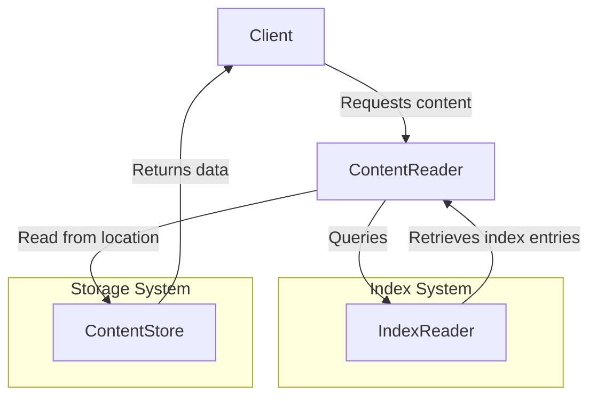

# Index specification


## Editors

- [Vasco Santos](https://github.com/vasco-santos)

## Authors

- [Vasco Santos](https://github.com/vasco-santos)

# Abstract

This document describes an indexing protocol that enables content-addressable data to be served efficiently by a server with access to stored verifiable packs and indexes.

## Language

The key words "MUST", "MUST NOT", "REQUIRED", "SHALL", "SHALL NOT", "SHOULD", "SHOULD NOT", "RECOMMENDED", "MAY", and "OPTIONAL" in this document are to be interpreted as described in [RFC2119](https://datatracker.ietf.org/doc/html/rfc2119).

# Overview

Smart client implementations MAY request a verifiable pack as a single verifiable blob (e.g. RAW) or as a verifiable pack of blobs (e.g., [CAR[(https://ipld.io/specs/transport/car/)]). The server relies on indexes that enable it to handle requests efficiently. This specification cover the index primitives to enable verifiable content retrievability.

## Fundamentals

There are three different **fundamental units**, which the indexing system MAY be able to index and enable queries for:

- A **Blob** is a set of bytes that is individually addressed by a multihash. It can be stored as is in a given store, or within a Pack.
- A **Pack** holds several Blobs and is also individually addressed by a multihash (can be seen as a Blob itself). Multiple **Packs** MAY store the same Blob.
- A **Containing** represents a set of Blobs/Packs. It can be individually addressed by a multihash and implies some cryptographic relationship.

This specification defines an indexing system that MUST support different implementations:

- **Single-level index**: Maps a given blob multihash to the location where the server can read the bytes.
- **Multiple-level index**: Maps a containing multihash to the set of verifiable pack multihashes that compose it.

The choice of which indexing strategy to use depends on performance, cost, and use case requirements. Depending on the available clients, the content provider's setup, or the usage context of the content-addressable server, the content provider can decide which indexing system to use—or whether to use both.

### Single-level index

A Single-level index maps blob multihashes to the locations where the server can read the bytes of a given blob. An indexing strategy with these records enables fast responses for clients requesting verifiable blobs by their multihash. However, in some setups, implementing this indexing strategy may be prohibitively expensive (e.g., in databases like DynamoDB) or limited (e.g., due to rate limiting when indexing thousands of blobs in parallel from large packs). Furthermore, these indexes alone are insufficient to serve fully verifiable packs, as they do not maintain cryptographic relationships between blobs or packs.

### Multiple-level index

A Multiple-level index maps containing multihashes to a list of verifiable packs containing the blobs that form a given cryptographic relationship. This approach allows serving fully verifiable packs efficiently while reducing index store operations by several orders of magnitude. However, this index alone cannot serve single blob requests unless the request includes hints about a containing multihash.

### Type Comparison

| Feature                                             | single-level Index | multiple-level Index |
| --------------------------------------------------- | ------------------ | -------------------- |
| Supports single blob lookups by blob multihash only | ✅                 | ❌                   |
| Supports content retrieval by containing multihash  | ❌                 | ✅                   |
| Storage operations                                  | High               | Low                  |
| Lookup speed for a blob                             | Fast               | Slower               |
| Lookup speed for containing packs/blobs             | Slower             | Fast                 |

## Design Principles

The design of the indexing system considers the following key aspects:

### Modular & Pluggable Indexing:

- The protocol supports multiple indexing strategies based on different trade-offs.
- Implementations can choose the best index type depending on cost, performance, and use case.
- Supports integrating new indexing mechanisms without requiring changes to the core protocol.

### Storage Efficiency & Cost Optimization:

- The protocol aims to minimize storage and retrieval costs by leveraging compact and structured index formats.

## System Design

The indexer system can be decoupled into a set of key components:

### Index Record

An index record has the necessary metadata to find the location where the bytes behind a given `MultihashDigest` rest. It can be represented as follows:

```ts
import { MultihashDigest } from 'multiformats'

type IndexRecord = {
  type: IndexRecordType
  // hash digest of the location or Path
  location: MultihashDigest | Path
  // length of the data
  length?: Int
  // offset of the data in the location byte stream
  offset?: Int
  // associated records
  subrecords: Array<IndexRecord>
}

// Record Type Enum
type IndexRecordType = BLOB | PACK | CONTAINING
type BLOB = 0
type PACK = 1
type CONTAINING = 2

type Path = string
```

### Index Store Reader

Index records can be read from a given store based on the following Reader interface.

```ts
import { MultihashDigest } from 'multiformats'

interface IndexStoreReader {
  get(hash: MultihashDigest): AsyncIterable<IndexRecord>
}
```

### Index Reader Interface

The index reader MUST support finding locations where given multihashes are stored.

```ts
import { MultihashDigest } from 'multiformats'

interface IndexReader<StoreRecord> {
  // Stores indexed entries
  store: IndexStore<StoreRecord>

  // Find the index records related to the requested multihash
  findRecords(
    multihash: MultihashDigest,
    // in a multiple-level-index this can be used with the containing Multihash
    // similar to https://github.com/ipfs/specs/pull/462
    options?: { contaningMultihash?: MultihashDigest }
  ): AsyncIterable<IndexRecord>
}
```

## Relationship Between Components

**Reading Previously Indexed Content**

1. A client requests content using a give Content Reader.
2. The Content Reader queries the appropriate Index (single-level or multi-level).
3. The Index Reader provides index records representing the location where requested multihash bytes are stored.
4. The Content Reader fetches the actual data based on the resolved locations (see `content-reader.md`).



For content retrieval, see the [Content Reader Specification](./content-reader.md).
